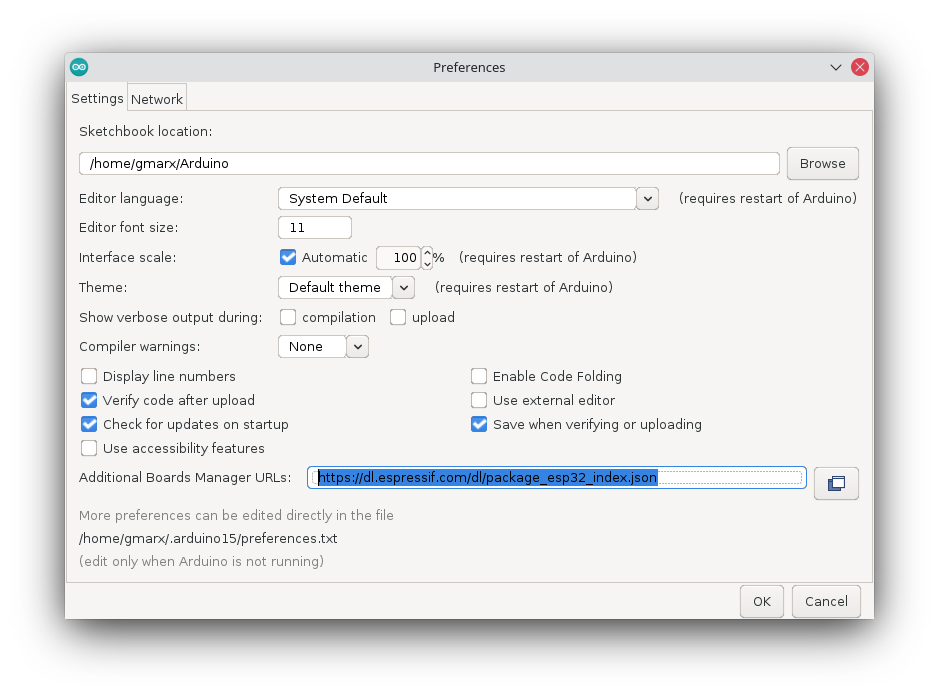
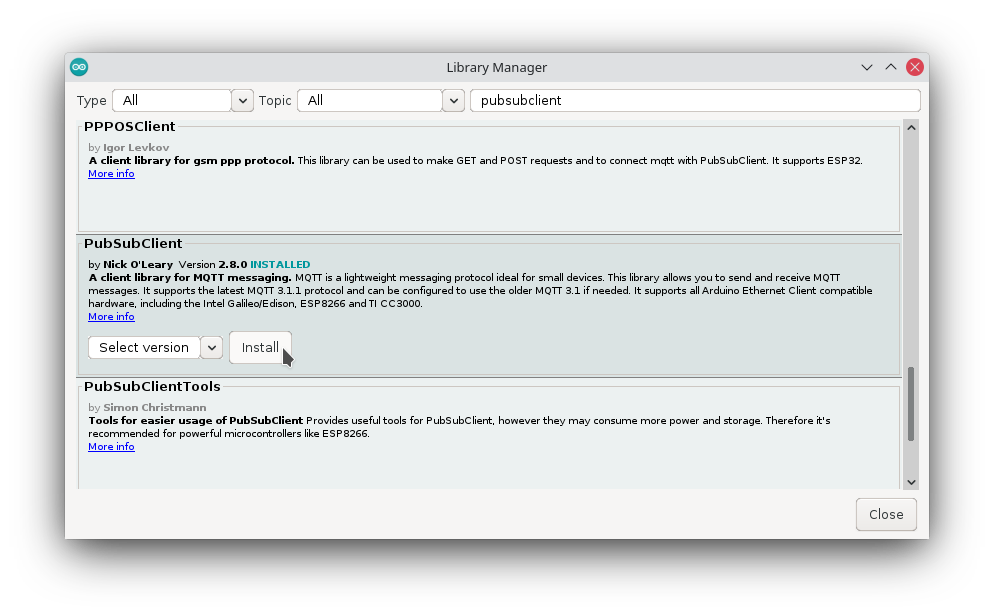
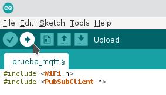
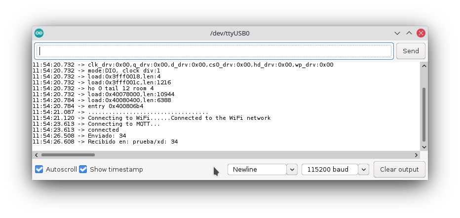

# Descarga de Arduino IDE

Lo primero que debemos hacer es descargar el archivo de instalacion desde [La pagina de descarga](https://www.arduino.cc/en/Main/Software)

Despues de descargarlo, lo extraemos, anrimos una terminal dentr de la misma carpeta, y ejecutamos el siguiente comando:

    sudo sh install.sh

Una vez en el IDE de arduino, es necesario configurar la tarjeta ESP-32, nos dirijimos al menu de **Archivo** y damos clic en la opcion de **Preferencias** y en el campo de **Gestor de tarjetas adicionales** escribimos la siguente direccion:

    https://dl.espressif.com/dl/package_esp32_index.json

Ahora nos dirijimos al menu de **Herramientas** y dentro de la opcion de **Tarjeta** buscamos la que llamada **ESP32 Dev Module**

Adicionalmente debemos ver en que puerto esta conectada nuestra tarjeta, para eso, dentro de la pestaña de herramientas buscamos la opcion de puerto, la mayoria de veces se conecta en el **ttyUSB0**

# Instalacion de libreria PubSubClient

Dentro del mismo menu de **Herramientas** nos vamos a la opcion de **Gestor de Librerias** y en el buscador escribimos **PubSubClient** e instalamos la librería

# Programa de ESP32

Copiamos el siguiente codigo dentro del programa

    #include <WiFi.h>
    #include <PubSubClient.h>

    const char* ssid = "NombreWIFI";
    const char* password = "ContraseñaWIFI";
    const char* mqttServer = "DireccionMQTT";
    const int mqttPort = 1883;
    const char* mqttUser = "MQTTuser";
    const char* mqttPassword = "MQTTpass";

    WiFiClient espClient;
    PubSubClient client(espClient);

    void OnMqttReceived(char *topic, byte *payload, unsigned int length)
    {
        Serial.print("Received on ");
        Serial.print(topic);
        Serial.print(": ");
        String content = "";
        for (size_t i = 0; i < length; i++)
        {
            content.concat((char)payload[i]);
        }
        Serial.print(content);
        Serial.println();
    }

    void setup()
    { Serial.begin(115200);
    WiFi.begin(ssid, password);
    Serial.println("...................................");

    Serial.print("Connecting to WiFi.");
    while (WiFi.status() != WL_CONNECTED)
        {  delay(500);
            Serial.print(".") ;
        }
    Serial.println("Connected to the WiFi network");

    client.setServer(mqttServer, mqttPort);
    while (!client.connected())
    {      Serial.println("Connecting to MQTT...");
        if (client.connect("prueba", mqttUser, mqttPassword ))
            {Serial.println("connected");
            client.subscribe("prueba/xd");
            client.setCallback(OnMqttReceived);
            }
        else
        {   Serial.print("failed with state ");
            Serial.print(client.state());
            Serial.println();
            delay(2000);
        }
    }
    }

    void loop()
    {  client.loop();
        char str[16];

        if(Serial.read()>0)
        {
        sprintf(str, "%u", random(100));

        client.publish("prueba/xd", str);
        Serial.println(str);
        delay(100);
        }

    }

Una vez pegado, cargamos el codigo con el icono que esta apuntando hacia la derecha, en la parte superior izquierda de la pantalla

# Posibles errores

## Permission denied

El error mas comun puede ser el siguiente:

    could not open port /dev/ttyUSB0: [Errno 13] Permission denied: '/dev/ttyUSB0'

Para resolver este error puedes escribir el siguiente comando en la consola

    sudo usermod -a -G dialout $USUARIO

Despues de ejecutar el comando anterior, cerramos y abrimos  nuevamente la sesion, despues de esto el programa deberia cargarse sin problemas

## No se detecta el esp32

Puede pasar (Mas comunmente en la version 22.04 de Ubuntu) que la tarjeta solo se detecta unos poco segundos justo despues de conectarla, y despues deja de aparecer.

Para solucionarlo debemos deshabilitar **brtltty**

    systemctl stop brltty-udev.service
    sudo systemctl mask brltty-udev.service
    systemctl stop brltty.service
    systemctl disable brltty.service

# Probar el cliente

Basicamente, recibe cualquier caracter del puerto serial, posteriormente genera un numero aleatorio, y lo envia al servidor mqtt, despues de enviarlo lo recibe nuevamente.

